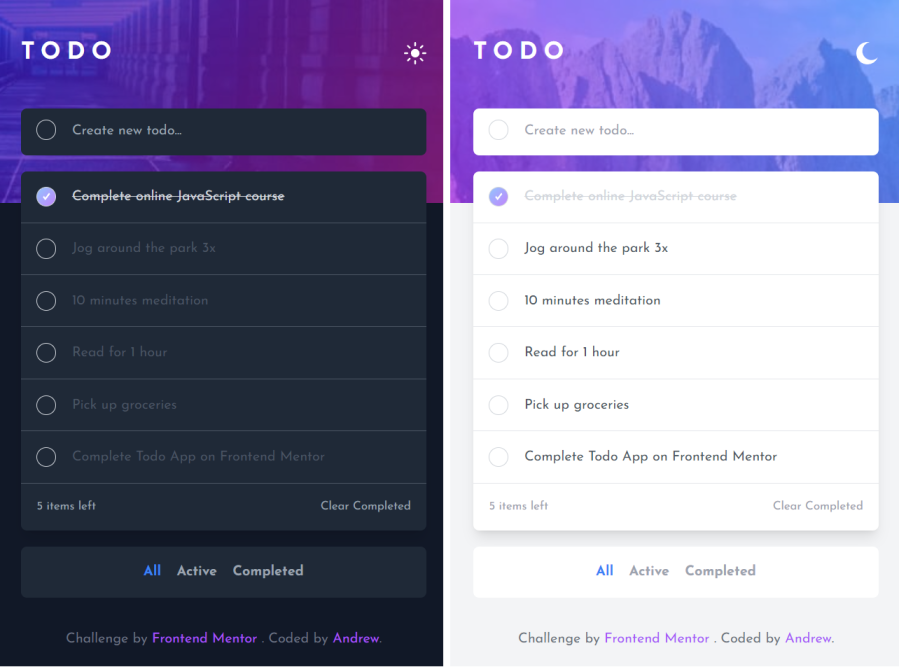

# Frontend Mentor - Todo app solution

This is a solution to the [Todo app challenge on Frontend Mentor](https://www.frontendmentor.io/challenges/todo-app-Su1_KokOW). Frontend Mentor challenges help you improve your coding skills by building realistic projects.

## Table of contents

- [Frontend Mentor - Todo app solution](#frontend-mentor---todo-app-solution)
  - [Table of contents](#table-of-contents)
  - [Overview](#overview)
    - [The challenge](#the-challenge)
    - [Screenshot](#screenshot)
    - [Links](#links)
    - [Developing](#developing)
      - [Clone](#clone)
      - [Develop](#develop)
      - [Build](#build)
  - [My process](#my-process)
    - [Built with](#built-with)
    - [What I learned](#what-i-learned)
  - [Author](#author)

## Overview

### The challenge

Users should be able to:

- View the optimal layout for the app depending on their device's screen size
- See hover states for all interactive elements on the page
- Add new todos to the list
- Mark todos as complete
- Delete todos from the list
- Filter by all/active/complete todos
- Clear all completed todos
- Toggle light and dark mode
- **Bonus**: Drag and drop to reorder items on the list

### Screenshot



### Links

- Solution URL: [https://www.frontendmentor.io/challenges/todo-app-Su1_KokOW/hub/todo-app-using-vue-and-tailwind-css-ryjhBiY89](https://www.frontendmentor.io/challenges/todo-app-Su1_KokOW/hub/todo-app-using-vue-and-tailwind-css-ryjhBiY89)
- Live Site URL: [https://ap2soft.github.io/frontend-mentor-todo-app/](https://ap2soft.github.io/frontend-mentor-todo-app/)

### Developing

#### Clone

```bash
git@github.com:ap2soft/frontend-mentor-interactive-comments-section.git
cd frontend-mentor-interactive-comments-section
npm install
```

#### Develop

```bash
npm run dev
```

#### Build

```bash
npm run build
```

## My process

### Built with

- [Tailwind CSS](https://tailwindcss.com) - A utility-first CSS framework
- [Vue3](https://vuejs.org/) - The Progressive JavaScript Framework
- Mobile-first workflow

### What I learned

I learned how to use Vue3 and how to deploy websites on Github Pages.

## Author

- Website - [Andrew](https://ap2.dev)
- Twitter - [@andreich1980](https://www.twitter.com/andreich1980)
